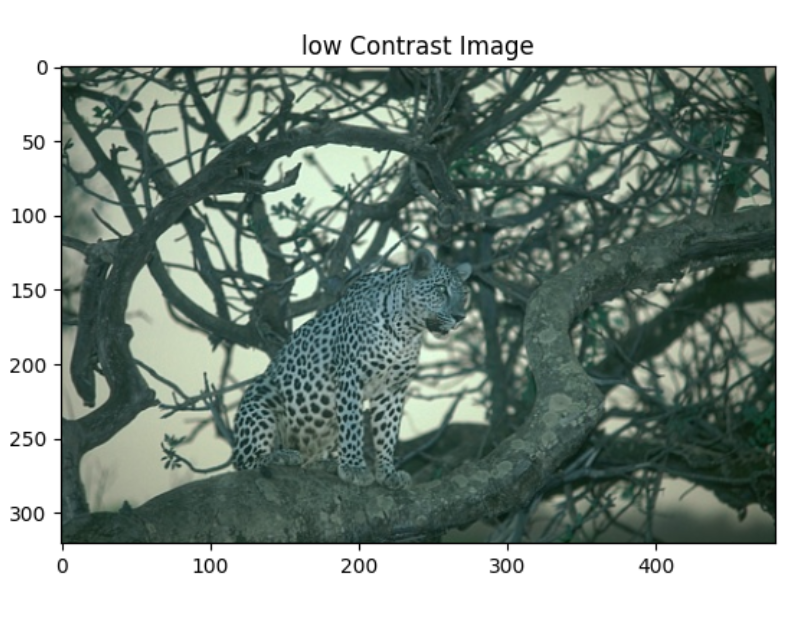

# Enhancing Image Contrast Using Histogram Equalization Techniques

In this project we cover the steps involved in analyzing and enhancing the contrast of a grayscale image using histogram equalization.

First, we load and display a grayscale image with low contrast.

We see that the image has minimal difference between the light and dark areas, making it difficult to distinguish details. 

Next we calculate the histogram of the grayscale image and plot it:

We see that the histogram of the low-contrast image is narrow, with most pixel values clustered around a small range, indicating limited variation in intensity levels. 

Next, we plot the Cumulative Distribution Function (CDF) of the image's histogram and evaluate its appropriateness as a histogram equalization function.

We know that the CDF shows the cumulative probability distribution of pixel intensities, and is theoretically the optimal transformation function for histogram equalization, as it aims to spread out the pixel intensities evenly across the entire range. As it can be seen, the CDF plot is nearly flat and gradually rises from 0 to 1 (if normalized), so the values are well-distributed.

Finally we apply the CDF to the image to perform histogram equalization, then display the transformed image and its new histogram. We see that the equalized image has improved contrast, with details more easily distinguishable. Also, the transformed histogram is more spread out across the intensity range, indicating a wider distribution of pixel values.

